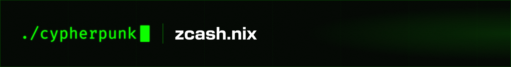

# zcash.nix [![GitHub Actions][gha-badge]][gha] [![X][x-badge]][x]

[gha]: https://github.com/cypherpunktech/zcash.nix/actions
[gha-badge]: https://github.com/cypherpunktech/zcash.nix/actions/workflows/check.yml/badge.svg
[x]: https://x.com/cypherpunk
[x-badge]: https://img.shields.io/twitter/follow/cypherpunk

Nix packages and NixOS modules for the [Zcash](https://z.cash) ecosystem, built from pinned source.

## Packages

| Package | | Binaries |
| --- | --- | --- |
| **zakura** | Zcash full node built for scale | `zakurad`, `zakura-prune-state`, `zakura-rollback-state` |
| **zebra** | Zcash Foundation's node | `zebrad` |
| **zaino** | Zingo Labs' indexer and proxy | `zainod` |
| **zinder** | ZF's service-oriented indexer | `zinder-ingest`, `-projector`, `-query`, `-compat-lightwalletd` |
| **ztreamer** | Light-wallet server with an embedded zakura node | `ztreamerd` |
| **lightwalletd** | Light-client backend | `lightwalletd` |
| **lightwalletd-rs** | Light-client backend, in Rust | `lightwalletd-rs` |
| **zallet** | RPC wallet replacing zcashd's | `zallet` and its zebra backend |
| **zpay** | Payments facilitator (x402, MPP) | `zpay-runtime`, `zspend-runtime` |

Built and run on `x86_64-linux`, `aarch64-linux`, and `aarch64-darwin`.

## Usage

```console
$ nix run github:cypherpunktech/zcash.nix#zakura -- --version
```

```nix
inputs.zcash-nix.url = "github:cypherpunktech/zcash.nix";
nixpkgs.overlays = [ zcash-nix.overlays.default ];
```

Prebuilt binaries come from `cypherpunktech.cachix.org`. On NixOS, `services.zcash.binaryCache.enable
= true`; elsewhere, two lines in `nix.conf`:

```
extra-substituters = https://cypherpunktech.cachix.org
extra-trusted-public-keys = cypherpunktech.cachix.org-1:WKo2WboMVH8HUtCKNsSFx31YQibaJ2eocruFvAzWgA4=
```

`--accept-flake-config` does the same for a trusted user only; for anyone else Nix ignores it silently
and builds from source.

Containers, one per package, non-root, state in `/data`:

```console
$ docker run -v zakura:/data ghcr.io/cypherpunktech/zakura:1.3.0 start
```

`nix develop github:cypherpunktech/zcash.nix#zcash` is a shell for building the Zcash software itself.
`lib.reproducibleRustPlatform` makes Rust builds bit-reproducible on macOS for packages of your own.

## NixOS Modules

```nix
imports = [ zcash-nix.nixosModules.default ];

services.zcash.zakura.mainnet = {
  enable = true;
  settings.rpc.listen_addr = "127.0.0.1:8232"; # freeform zakura.toml
};
```

One module per package. Nodes and indexers are multi-instance (`zakura.mainnet`, `zakura.testnet`),
each its own unit and state directory. Every service runs as a dynamic user with no capabilities, a
read-only system, and a syscall filter; `user` lets two services share a state directory.

The modules refuse to guess on security: `openFirewall` never opens RPC, lightwalletd requires TLS
or an explicit `insecureNoTLS`, and zallet requires `acceptBetaRisk` because it holds spending keys.
Secrets (TLS keys, RPC credentials) are `*File` options naming a file outside the store; systemd hands
each service its own copy, so a `sops-nix` or `agenix` path works as is. An indexer names the node it
follows (`zaino.<i>.node`) and starts after that node's RPC answers, with its cookie.

Every option: [docs/options.md](docs/options.md).

## Verification

Each claim is a CI job that goes red when it stops being true.

- Every binary is built and executed on every platform it claims, and ships no toolchain in its closure.
- Every module boots in a VM, including a stack that mines blocks, indexes them, and serves a wallet,
  and a node, light-wallet server and client on three machines.
- Builds are rebuilt and compared byte for byte; the cache is checked to serve, signed, every build.
- Dependencies are scanned daily for vulnerabilities; signed releases are verified against the source
  built; every pinned source is re-fetched.
- Bumps are proposed weekly, tested everywhere, and merged when green.
- The published flake, cache and images are exercised daily from a machine that has nothing but a URL.

See [SECURITY.md](SECURITY.md) for what is and is not guaranteed.

## Contributing

See [`CONTRIBUTING.md`](CONTRIBUTING.md) and [`AGENTS.md`](AGENTS.md).

## License

[MIT](LICENSE). Each packaged project keeps its own license.
